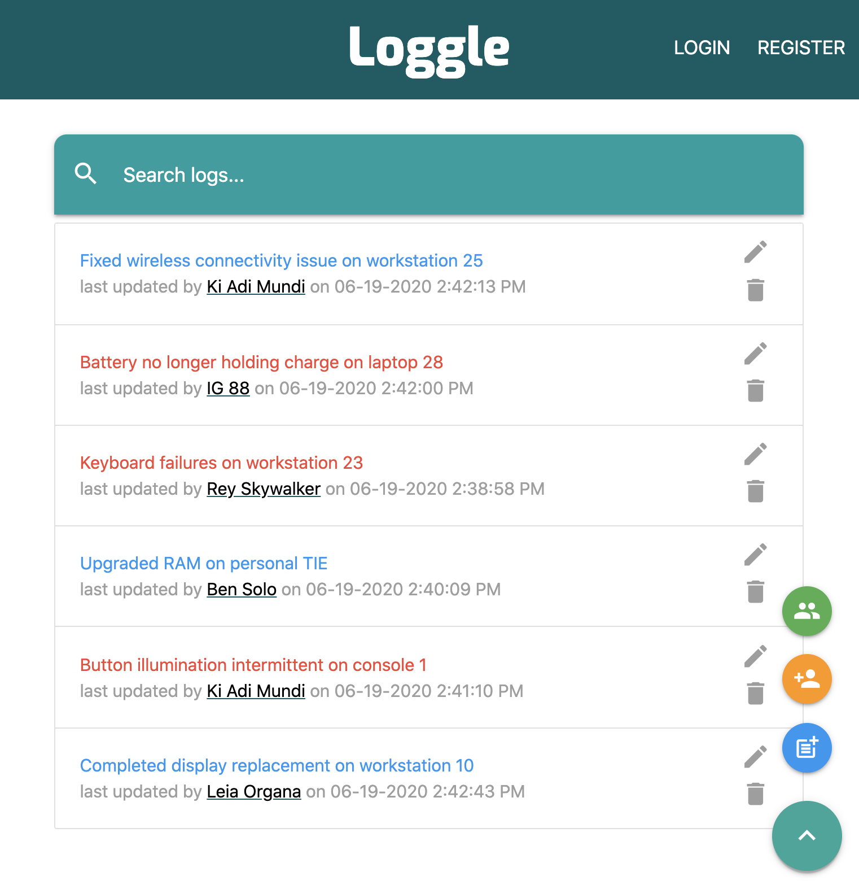
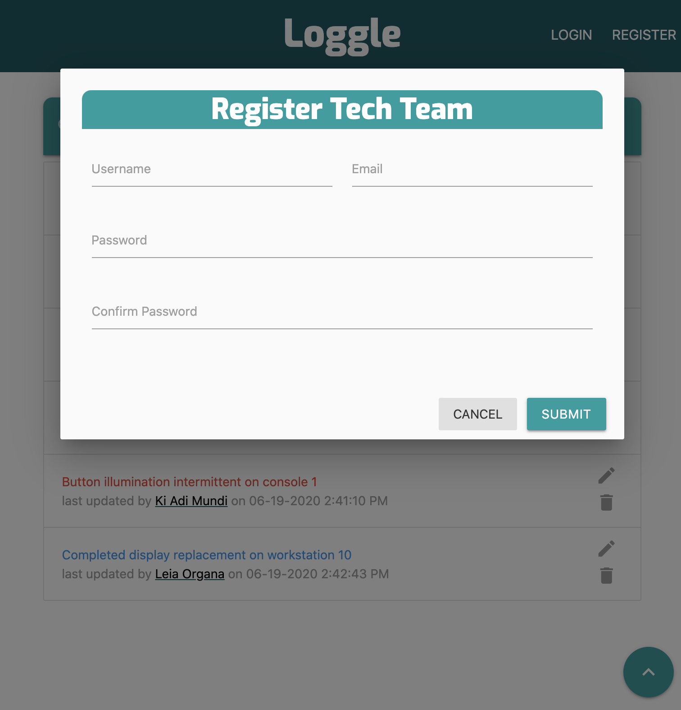
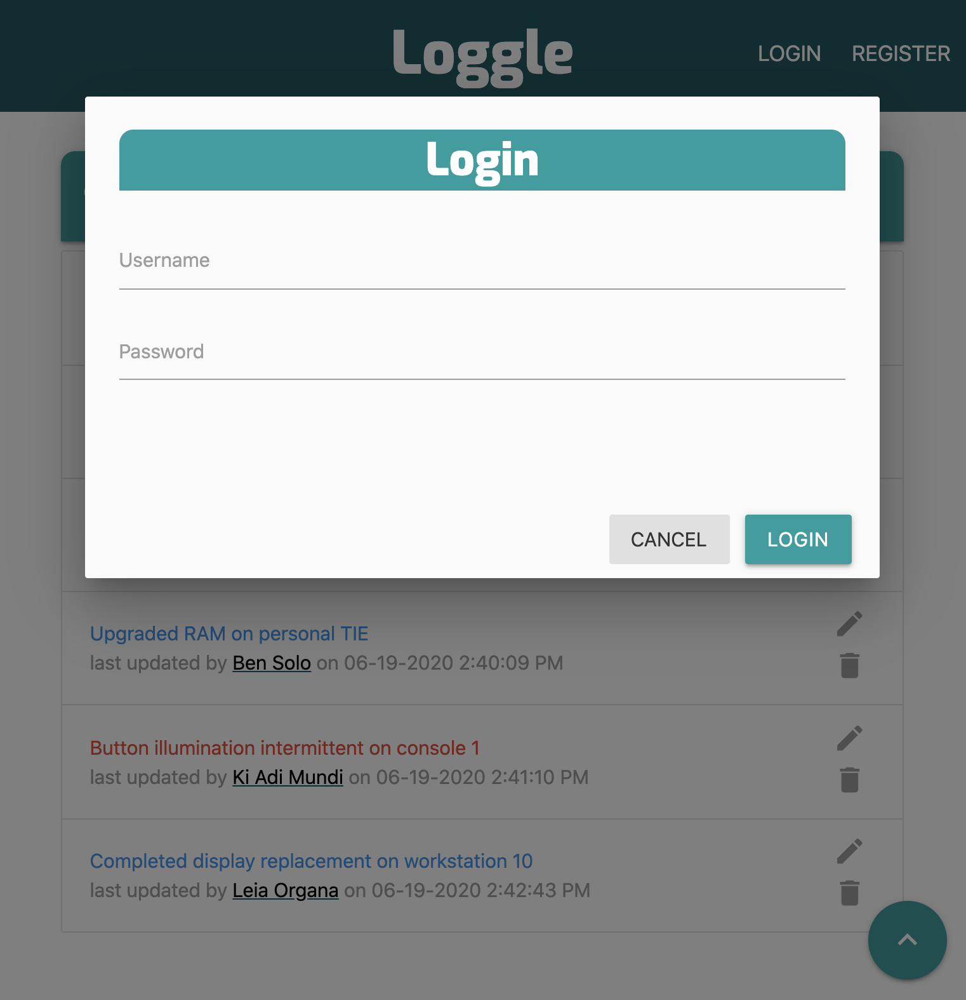
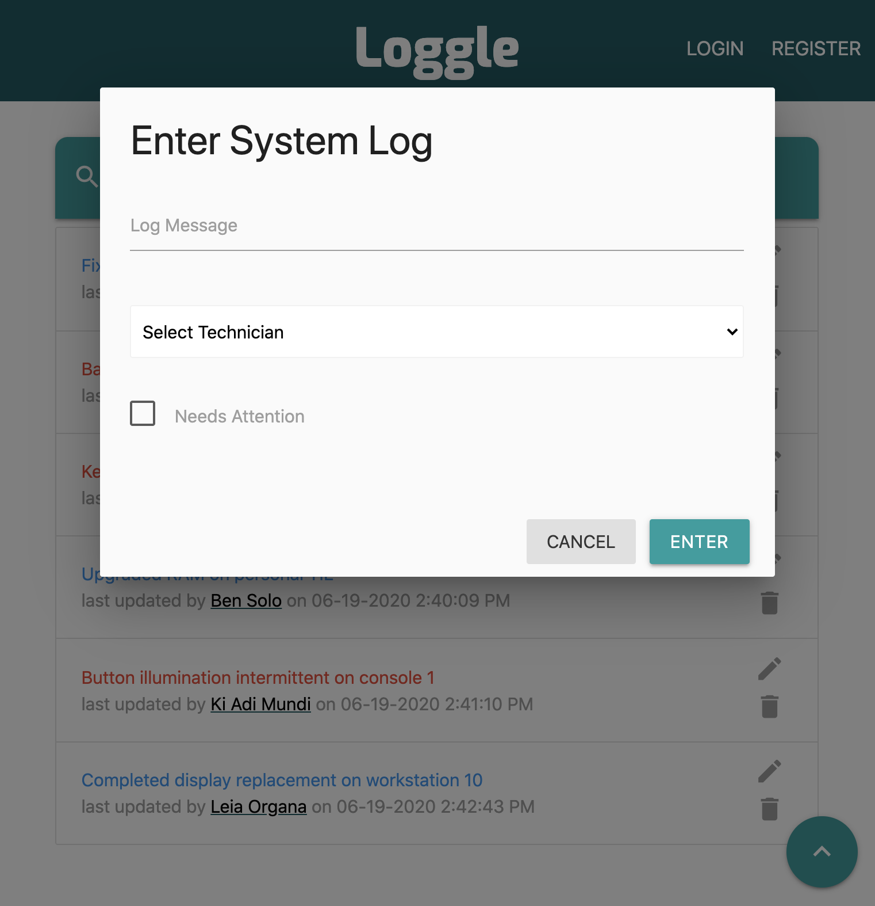
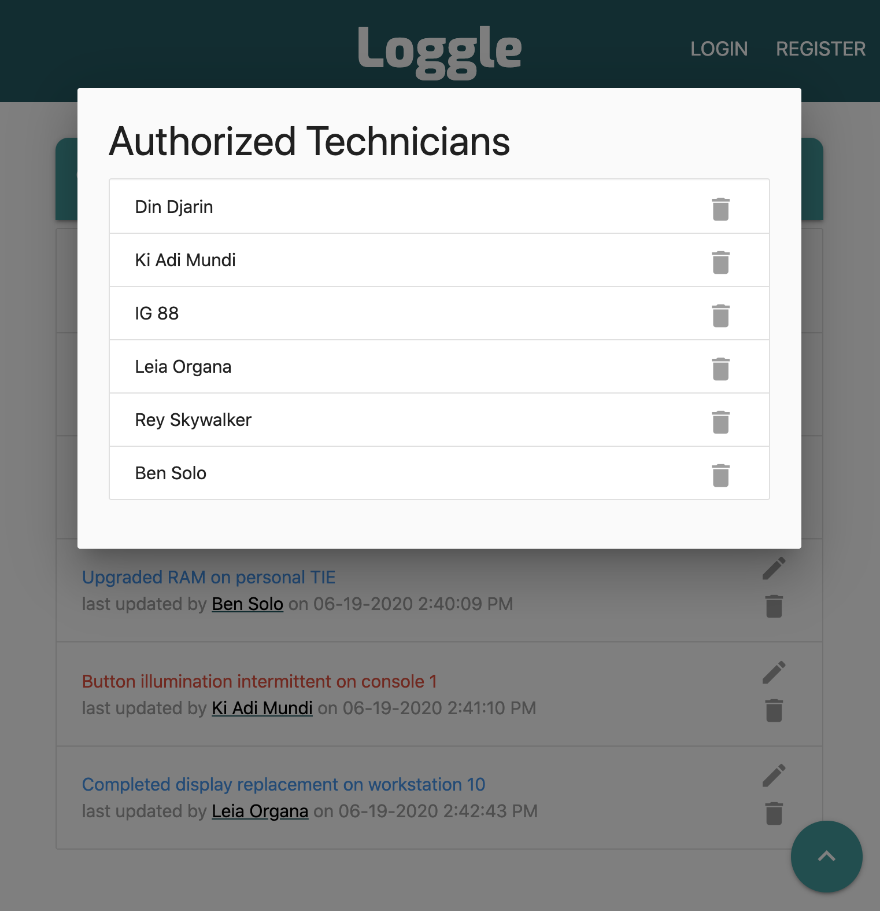

## Loggle

Loggle is a full stack single-page web application that allows IT departments to log and update support tickets. Logs can be filtered from the search bar either by entering a keyword or by clicking on a specific technician’s name. Departments can register a technician team to manage private logs or to add or remove technicians from a team. If not logged in, full application interaction is available using the populated default data.

The frontend of the application was built with React and Redux, and styled with custom CSS and the Materialize CSS framework. Backend routing and authentication was built with Node and Express. Mongoose and MongoDB Atlas were used for managing persistent data.

You can find Loggle deployed on Heroku at:  
https://loggle.herokuapp.com/  

---
 
---
 
---

---

---
